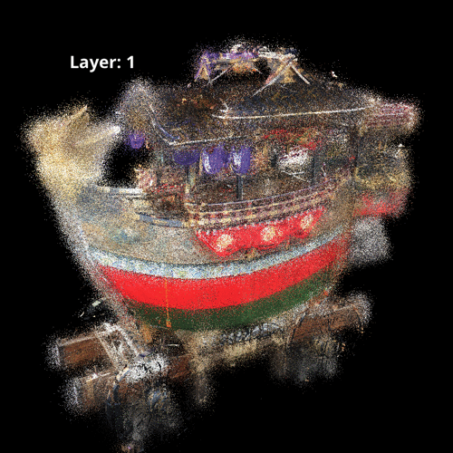
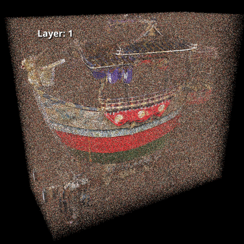
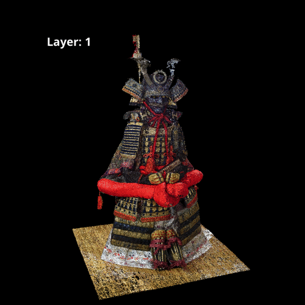
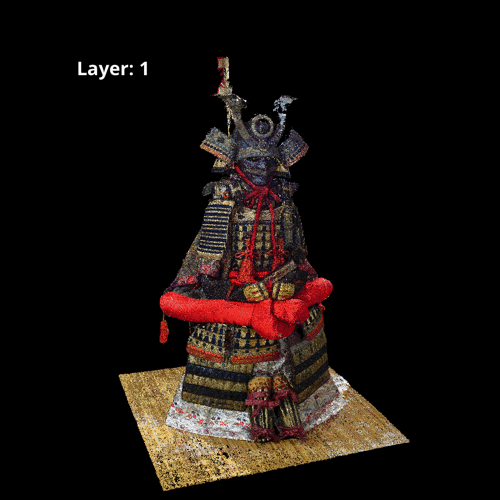
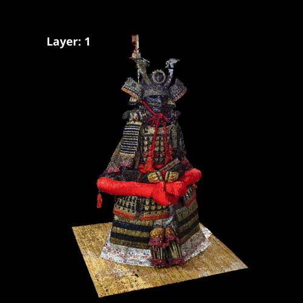

# Depth_Peeling_for_Point_Cloud

## Visualization of peeling process
### Noise Point Clouds
|Gaussian noise (10%)|Outlier noise (10%)|
|:-:|:-:|
|||

### Various Number of Points
|400,000 points (1%)|2,000,000 points (5%)|
|:-:|:-:|
|||

|4,000,000 points (10%)|1,0000,000 points (25%)|
|:-:|:-:|
|||

## New Command
```
#/LayerLevel 1
```

## Usage
```
$ sh config_dp.sh
$ make
$ make install

$ make test_ply_ascii
$ make test_ply_binary
$ make test_spbr_ascii
$ make test_spbr_binary
```


### Example
```
$ cat .param.spbr
#/LayerLevel 20

$ ./dp input.ply

===== Depth Peeling for Point Cloud =====

                2021/02/07
              Tomomasa Uchida
           Ritsumeikan University

 USAGE : dp file1.spbr file2.spbr ...
 HELP  : dp -h

~~~

Executing Depth Peeling "20" times...
Done! ( 0.3871 [sec] )

Automatically, snapshotted.
Saved image path: IMAGE_DATA/OUTPUT_LAYER_IMAGES/LayerImageX.bmp
```

<!-- ## Visualization Results

|Layer1|Layer5|Layer10|
|:-:|:-:|:-:|
||||

|Layer20|Layer30|Layer40|
|:-:|:-:|:-:|
||||

|Layer50|Layer60|Layer70|
|:-:|:-:|:-:|
||||

|Layer80|Layer90|Layer100|
|:-:|:-:|:-:|
|||| -->

<!-- ## Layer Image Averaging
|Original|Layer1-5|Layer1-10|
|:-:|:-:|:-:|
|||| -->