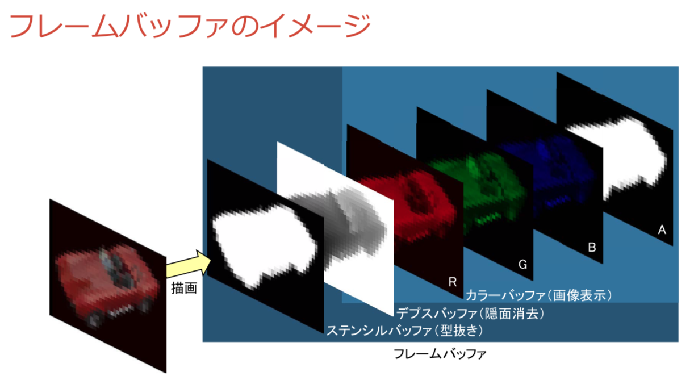

## Vertex Buffer Object
- VBOは，頂点データを格納するGPU側のメモリに置かれたバッファのこと．
- VBOに，頂点の位置や色，法線，テクスチャ座標等を格納する．

<br>

## Framebuffer Object


- FBO は，Framebuffer をオフラインで使用することができる．
   - Framebuffer は，OpenGLのレンダリングパイプラインにおいて最終的なレンダリング結果を描画するのに用いられる．



- FBOは，Color Buffer, Depth Buffer, Stencil Bufferを内包している
- FBOには，最大で3種類のRenderBuffer（かTextureBuffer）をアタッチできる．
- `GL_COLOR_ATTACHMENT0`：FBOのデフォルトの描画バッファ．

### Color Buffer
- <b>レンダリング結果の画像を格納するバッファ．</b>
   - <b>この内容が画面に表示される．</b>
- Double Buffering：
   - 二つのColor Bufferを使用することで，描画過程が見えないようにする手法．
   - Front Buffer（画面に表示されているバッファ）とBack Buffer（描画を行うバッファ）を入れ替えて使用（Swap Buffers）する．

### Depth Buffer（Z-buffer）
- 隠面消去処理を行うことで，視点（カメラ）に最も近いオブジェクトを表示する．
- <b>視点（カメラ）に最も近いオブジェクトのデプス（深度）を各画素に格納する．</b>
   1. 描画しようとしているオブジェクトの深度と既に格納されている深度を比較する．
   2. 深度が小さい方（視点に近い方）のオブジェクトの色を表示し，その深度を格納する．
- オブジェクトを描画する前に，Depth Bufferを更新する必要がある．
   - デプスの更新方法：`glEnable(GL_DEPTH_TEST);`

### Stencil Buffer
- 表示図形の「型抜き」に使用する．

<br>

## OpenGL Functions

### `glBindTexture()`
#### Description
- 指定した名前の Texture をを有効にする．
#### Syntax
```
void glBindTexture(
    GLenum target,  // Texture の次元
    GLuint texture  // Texture 名
);
```

### `glReadPixels()`

#### Description
- Framebuffer の内容をCPU側のメモリに読み込む．
#### Syntax
```
void glReadPixels(
    int x, int y                // 読み取る領域の左下隅のWindow空間のx, y座標
    unsigned int width, height  // 読み取る領域の幅，高さ
    GL_BGRA,                    // 取得したい色情報の形式
    GL_UNSIGNED_BYTE,           // 読み取ったデータを保存する配列の型
    void *buf                   // 読み取ったデータを保存する配列
);
```

### `glCopyTexImage2D()`
#### Description
- Framebuffer から画像データを TextureObject にコピーする．
- `glReadPixels()`よりも高速．
#### Syntax
```
void glCopyTexImage2D(
    int tgt,
    int lvl,
    int ifmt,       // コピーすべき対象を指定する
    int x,y,w,h,    // コピーする Framebuffer の矩形
    int border
);
```

<br>

## Reference
- https://web.wakayama-u.ac.jp/~tokoi/lecture/gg/
- https://qiita.com/edo_m18/items/95483cabf50494f53bb5
- http://wisdom.sakura.ne.jp/system/opengl/gl15.html
- https://ooo.iiyudana.net/htm/gl_chp28frame.htm