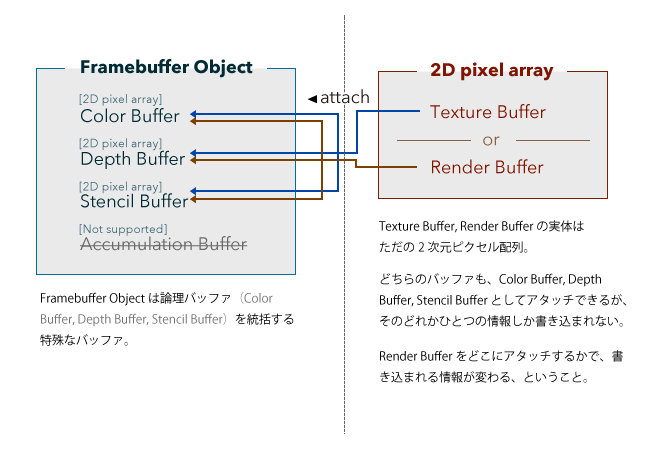

## Vertex Buffer Object
- VBOは，頂点データを格納するGPU側のメモリに置かれたバッファのこと．
- VBOに，頂点の位置や色，法線，テクスチャ座標等を格納する．

 

## Frame Buffer Object

- FBOは，フレームバッファをオフラインで使用することができる．
   - フレームバッファは，OpenGLのレンダリングパイプラインにおいて最終的なレンダリング結果を描画するのに用いられる．

- FBOは，Color Buffer, Depth Buffer, Stencil Bufferを内包している
- FBOには，最大で3種類のRenderBuffer（かTextureBuffer）をアタッチできる．
- `GL_COLOR_ATTACHMENT0`：FBOのデフォルトの描画バッファ．

### Color Buffer
- <b>レンダリング結果の画像を格納するバッファ．</b>
   - <b>この内容が画面に表示される．</b>
- Double Buffering：
   - 二つのColor Bufferを使用することで，描画過程が見えないようにする手法．
   - Front Buffer（画面に表示されているバッファ）とBack Buffer（描画を行うバッファ）を入れ替えて使用（Swap Buffers）する．

### Depth Buffer（Z-buffer）
- 隠面消去処理を行うことで，視点（カメラ）に最も近いオブジェクトを表示する．
- <b>視点（カメラ）に最も近いオブジェクトのデプス（深度）を各画素に格納する．</b>
   1. 描画しようとしているオブジェクトの深度と既に格納されている深度を比較する．
   2. 深度が小さい方（視点に近い方）のオブジェクトの色を表示し，その深度を格納する．

### Stencil Buffer
- 表示図形の「型抜き」に使用する．

 

## Reference
- https://web.wakayama-u.ac.jp/~tokoi/lecture/gg/
- https://qiita.com/edo_m18/items/95483cabf50494f53bb5