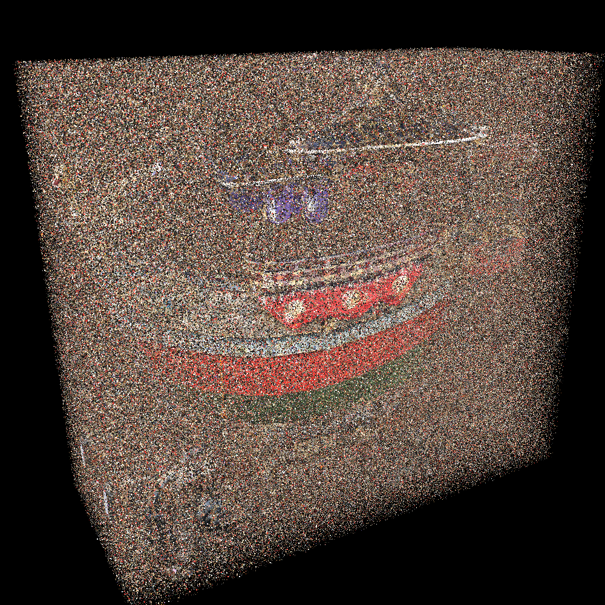
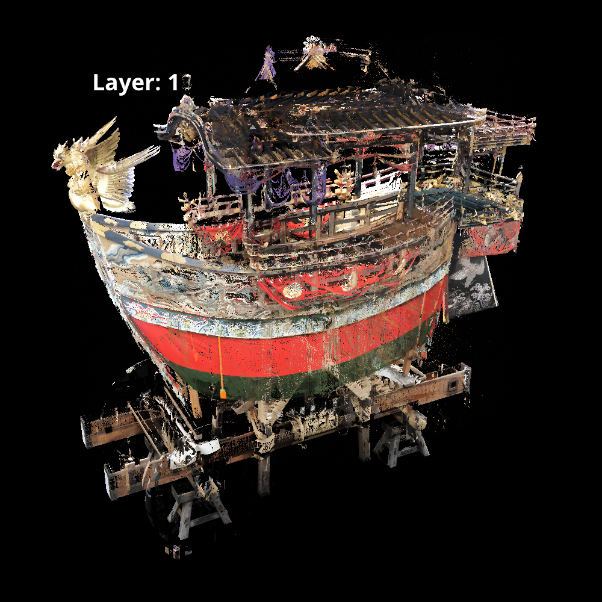
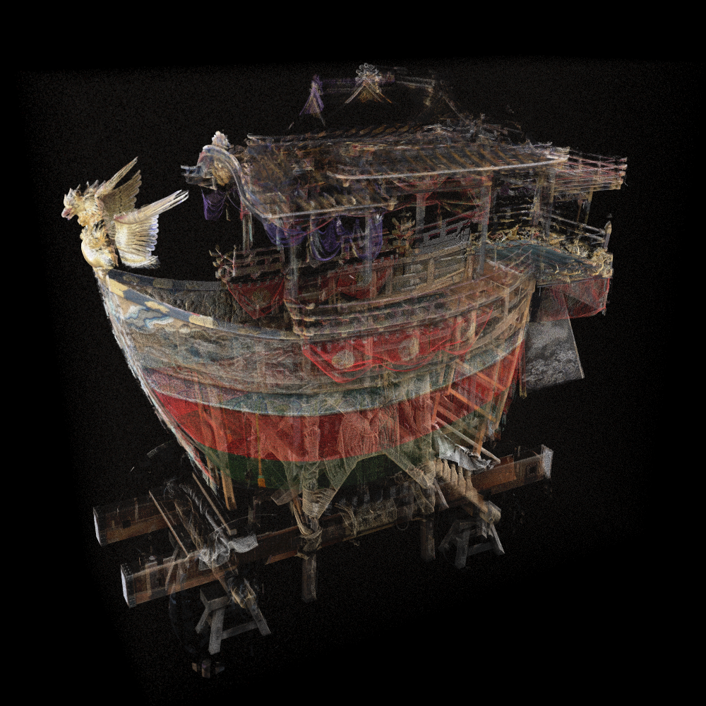
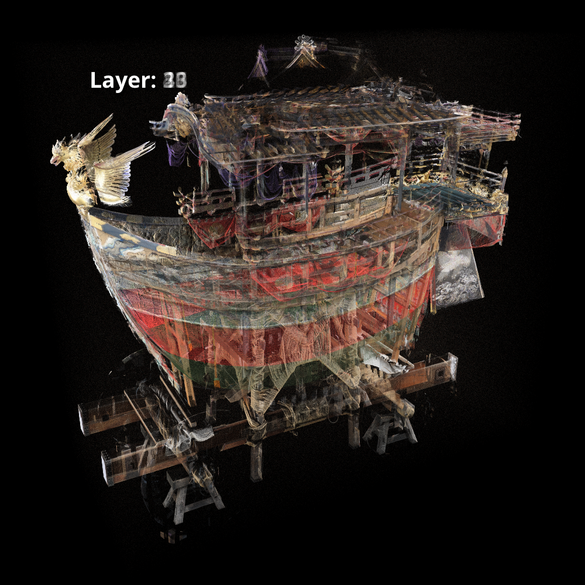
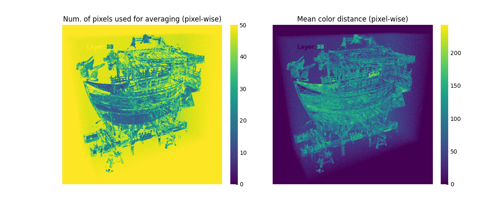

# Adaptive Layer Image Averaging

## Visualization Results
### Proposed method
|Input (outlier noise 10%)|Adaptive layer image averaging|
|:-:|:-:|
|||

### Conventional method
|SPBR(L=50)|Simple layer image averaging|
|:-:|:-:|
|||

## Visualization for analysis of proposed method

